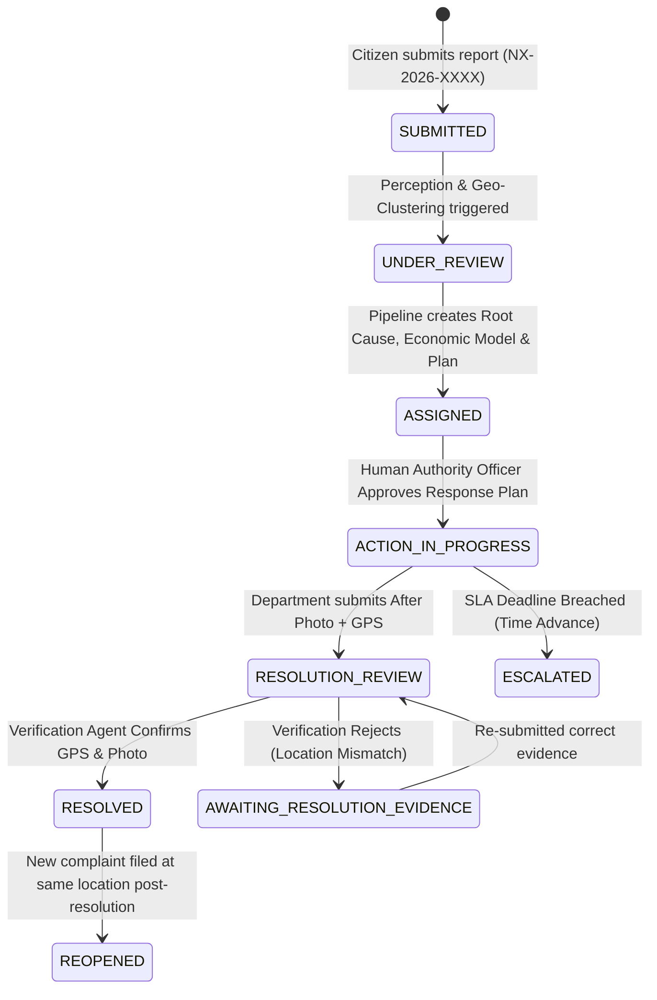

# CivicNexus AI — Complete Project Architecture & Technical Master Notes

> **Team:** Team Nexus  
> **Tagline:** *"Decoding Fragmented Citizen Signals into Unified Urban Intelligence."*  
> **Framing Line:** *"Cities don't suffer from a lack of civic complaints. They suffer from isolated incident silos that mask compounding systemic infrastructure failures."*

---

## 📑 Table of Contents
1. [Executive Summary & Core Philosophy](#1-executive-summary--core-philosophy)
2. [Technology Stack & System Architecture](#2-technology-stack--system-architecture)
3. [The 11 Autonomous AI Agents Deep-Dive](#3-the-11-autonomous-ai-agents-deep-dive)
4. [Mathematical Formulas & Core Algorithms](#4-mathematical-formulas--core-algorithms)
5. [Complete REST API Specification](#5-complete-rest-api-specification)
6. [Shared State Schema & Incident Lifecycle State Machine](#6-shared-state-schema--incident-lifecycle-state-machine)
7. [The 4 Guaranteed Demo Scenarios & Datasets](#7-the-4-guaranteed-demo-scenarios--datasets)
8. [Resolution Verification & Two-Beat Demo Flow](#8-resolution-verification--two-beat-demo-flow)
9. [Complete Codebase File Tree & Module Directory Map](#9-complete-codebase-file-tree--module-directory-map)
10. [Production Readiness & Future Roadmap](#10-production-readiness--future-roadmap)

---

## 1. Executive Summary & Core Philosophy

### The Real-World Civic Problem
In conventional municipal complaint systems (e.g., 311 portals, civic mobile apps), complaints are processed in isolated silos:
- Citizen A files a complaint about an underground **water main leak**.
- Citizen B files a complaint about **cracked asphalt road base** 40 meters away.
- Citizen C files a complaint about a **dangerous pothole** 60 meters away.
- Citizen D files a complaint about **waterlogging and vehicle accidents** 80 meters away.

**Why Traditional Systems Fail:**
1. Each complaint is routed independently to separate departments (Water Board, Roads Dept, Traffic Dept).
2. The Roads department repaves the road over an active underground water leak.
3. The road foundation erodes again within 2 weeks, leading to repetitive tax waste and citizen frustration.
4. Minor isolated complaints outnumber major systemic hazards, hiding critical infrastructure cascades.

### The CivicNexus AI Solution
CivicNexus AI acts as an **Autonomous Multi-Agent Urban Incident Intelligence Matrix**. It continuously correlates independent citizen reports, traces the **underlying root-cause dependency graph**, calculates **real-time municipal tax savings** from preventative coordinated repairs, dynamically sequences department work orders, and enforces **before/after GPS and photo verification** before closing tickets.

---

## 2. Technology Stack & System Architecture

```
┌────────────────────────────────────────────────────────────────────────┐
│                      CIVICNEXUS AI ARCHITECTURE                        │
└────────────────────────────────────────────────────────────────────────┘
                                   │
                  ┌────────────────┴────────────────┐
                  ▼                                 ▼
       ┌──────────────────────┐          ┌──────────────────────┐
       │   React 19 + Vite    │          │  Cloudflare Tunnel   │
       │    Frontend (UI)     │          │  (trycloudflare.com) │
       └──────────────────────┘          └──────────────────────┘
                  │                                 │
                  ▼                                 ▼
       ┌────────────────────────────────────────────────────────┐
       │              FastAPI Backend (Port 8000)               │
       └────────────────────────────────────────────────────────┘
                                   │
         ┌─────────────────────────┼─────────────────────────┐
         ▼                         ▼                         ▼
┌──────────────────┐     ┌──────────────────┐     ┌──────────────────┐
│  11 Autonomous   │     │ Hybrid AI Engine │     │   JSON Storage   │
│ Pipeline Agents  │     │ (Gemini / Claude │     │    Data Layer    │
│                  │     │ / Deterministic) │     │                  │
└──────────────────┘     └──────────────────┘     └──────────────────┘
```

### Frontend Stack:
- **Framework:** React 19 + TypeScript (Strict mode)
- **Bundler / Dev Server:** Vite 8.1
- **Styling:** Tailwind CSS v4 with custom Obsidian/Emerald Cyber theme and glassmorphic cards
- **Icons:** Lucide React (`Activity`, `Shield`, `Sparkles`, `TrendingUp`, `Repeat`, `AlertCircle`, etc.)
- **Charts / Visualizations:** Recharts & SVG custom radial gauges (`ImpactGauge.tsx`)
- **Routing:** React Router DOM v7
- **API Communication:** Relative URL proxy through Vite reverse proxy to avoid CORS/network issues across public tunnels.

### Backend Stack:
- **Language / Runtime:** Python 3.12
- **Web Framework:** FastAPI 0.115 + Uvicorn ASGI Server
- **Data Validation & Schemas:** Pydantic v2
- **Image Processing:** Pillow (PIL)
- **AI / LLM Integration (Hybrid Multi-Tier):**
  - *Tier 1 (Live Multimodal Vision):* Google Gemini Multimodal Vision (`gemini_service.py`) for live uploaded photos.
  - *Tier 2 (Live Narrative):* Anthropic Claude (`ai_service.py`) for live reasoning synthesis.
  - *Tier 3 (Deterministic Fallback):* Seed lookup table (`perception_lookup.json`) for zero-latency, 100% offline-stable hackathon demonstrations.
- **Storage Layer:** High-speed atomic JSON persistence (`data/complaints.json`, `data/incidents.json`, `data/agent_logs.json`).

---

## 3. The 11 Autonomous AI Agents Deep-Dive

CivicNexus coordinates 11 distinct autonomous agents:

| # | Agent Name | Primary Responsibility | Input Data | Output / Decision |
|---|------------|------------------------|------------|-------------------|
| **1** | **Perception Agent** | Analyzes complaint photos + text descriptions. Detects category, severity, and visual evidence. | Photo upload / seed image + description | `issue_type`, `severity`, `confidence`, `evidence_text` |
| **2** | **Geo-Temporal Clustering Agent** | Finds geographically and temporally related reports. | GPS `(lat, lon)` + `timestamp` of all reports | Cluster object with radius, centroid, and related report IDs |
| **3** | **Incident Detection Agent** | Determines if the cluster is an isolated report, duplicate, or systemic multi-point incident. | Unique issue types + report count in cluster | Classification: `INDEPENDENT`, `DUPLICATE`, `POSSIBLE_CONNECTED`, or `HIGH_CONFIDENCE_CONNECTED` |
| **4** | **Root-Cause Agent** | Traces causal dependencies across observed issues. | Observed issue types + `civic_dependencies.json` | Causal chain (`A -> B -> C -> D`), Confidence, AI Hypothesis + Mandatory Inspection Disclaimer |
| **5** | **Civic Impact Agent** | Scores real-world public threat severity (0–100). | Severity, proximity, duration, population affected, repeat reports, secondary risks | Numerical score (0–100), Priority (`LOW`, `MEDIUM`, `HIGH`, `CRITICAL`), Factor breakdown |
| **6** | **Economic Optimization Agent** *(New Original Feature)* | Calculates municipal tax savings and prevented road re-digging cycles. | Issue types + impact score + cluster density | Projected municipal tax savings (INR), Prevented excavation cycles, Longevity index |
| **7** | **Response Agent** | Synthesizes a dependency-ordered multi-department action plan. | Identified issues + root cause chain + `departments.json` | Ordered list of departmental steps with SLAs, dependencies, and rationale (Human approval gate) |
| **8** | **Municipal Dispatch Agent** | Generates traceable municipal tracking tickets. | Incident context + department assignments | Formal municipal dispatch work orders (`MUNI-NEXUS-[INC_ID]`) |
| **9** | **SLA & Escalation Agent** | Monitors deadlines and triggers manager alerts upon SLA breach. | Incident status, SLA deadline, current/simulated time | Status transition to `ESCALATED` + Overdue breach reason |
| **10**| **Verification Agent** | Validates resolution claims using before/after GPS and photos. | Before photo/GPS vs After photo/GPS + subsequent reports | `RESOLUTION_VERIFIED`, `LOCATION_MISMATCH`, or `POSSIBLE_FAILED_RESOLUTION` |
| **11**| **Central Orchestrator** | Coordinates agent lifecycle and state machine persistence. | Incident context pipeline requests | Executes agents in pipeline, manages single write lock to disk |

---

## 4. Mathematical Formulas & Core Algorithms

### 1. Haversine Geo-Distance Formula
Used in `backend/tools/geo_tools.py` for pure Python geographical calculations:

$$\Delta\phi = \text{radians}(\text{lat}_2 - \text{lat}_1)$$
$$\Delta\lambda = \text{radians}(\text{lon}_2 - \text{lon}_1)$$
$$a = \sin^2\left(\frac{\Delta\phi}{2}\right) + \cos(\text{radians}(\text{lat}_1)) \cdot \cos(\text{radians}(\text{lat}_2)) \cdot \sin^2\left(\frac{\Delta\lambda}{2}\right)$$
$$c = 2 \cdot \text{atan2}(\sqrt{a}, \sqrt{1 - a})$$
$$d = R \cdot c \quad (\text{where } R = 6,371,000 \text{ meters})$$

- **Clustering Threshold:** Any report within $r \le 180\text{ meters}$ and $t \le 7\text{ days}$ is clustered.
- **Verification Threshold:** Resolution GPS proof must be within $d \le 100\text{ meters}$ of the original incident centroid.

---

### 2. Civic Impact Weighted Scoring Equation
Used in `backend/tools/impact_tools.py` to calculate public threat priority (0 to 100):

$$\begin{aligned}
\text{Impact Score} = & (0.30 \times \text{Severity}) \\
& + (0.20 \times \text{Infrastructure Proximity}) \\
& + (0.15 \times \text{People Affected}) \\
& + (0.10 \times \text{Duration}) \\
& + (0.10 \times \text{Repeat Reports}) \\
& + (0.15 \times \text{Secondary Risk})
\end{aligned}$$

#### Factor Weights:
- **Severity ($30\%$):** `CRITICAL` = 100, `HIGH` = 80, `MEDIUM` = 50, `LOW` = 25.
- **Infrastructure Proximity ($20\%$):** Scans description & address for keywords (`hospital`, `school`, `metro`, `station`, `market`, `temple`, `bus stop`). Score = 85–100 if detected, else 30.
- **People Affected ($15\%$):** $\min(\text{report\_count} \times 15, 60) + \text{keyword boost } (30)$ for keywords like `pedestrian`, `commuter`, `traffic`, `colony`.
- **Duration ($10\%$):** $\le 1\text{d}=20$, $\le 3\text{d}=50$, $\le 7\text{d}=70$, $\le 14\text{d}=85$, $>14\text{d}=100$.
- **Repeat Reports ($10\%$):** $1\text{ rpt}=10$, $2\text{ rpt}=30$, $3\text{--}4\text{ rpt}=60$, $5\text{--}6\text{ rpt}=80$, $>6\text{ rpt}=100$.
- **Secondary Risk ($15\%$):** Risk mapped to danger level: `EXPOSED_WIRES` (95), `SEWAGE_OVERFLOW` (80), `WATERLOGGING` (65), `POTHOLE` (60), `WATER_LEAKAGE` (55) $+ \text{cascade bonus}$.

---

### 3. Economic Impact & ROI Model
Implemented in `backend/tools/economic_tools.py`:

$$\text{Estimated Damage if Neglected} = \left(\sum \text{Unit Damage Per Week} \times 4\right) \times \left(\frac{\text{Impact Score}}{50}\right) \times (1.0 + 0.1 \times \text{Report Count})$$
$$\text{Coordinated Root Fix Cost} = \sum \text{Unit Root Repair Cost} \times 1.15$$
$$\text{Projected Tax Savings (INR)} = \text{Estimated Damage if Neglected} - \text{Coordinated Root Fix Cost}$$

---

## 5. Complete REST API Specification

### 1. Citizen Complaint Endpoints
- `POST /reports`: Submits a complaint. Accepts `multipart/form-data` with either an uploaded image or demo seed image name, GPS coordinates, description, and citizen details.
- `GET /reports`: Lists all reports with optional `?ward=` and `?status=` query filters.
- `GET /reports/{report_id}`: Returns single report details.

### 2. Autonomous Agent Analysis Endpoints
- `POST /analyze/{report_id}`: Triggers the full 8-stage orchestrator pipeline for a report. Returns step-by-step agent decisions, logs, and generated incident ID.
- `POST /incidents/{incident_id}/analyze`: Re-runs pipeline analysis on an existing incident.

### 3. Incident Management & Human-in-the-Loop
- `GET /incidents`: Returns all active and resolved incidents.
- `GET /incidents/{incident_id}`: Returns complete incident context (root cause, logs, impact, economic model, plan).
- `GET /incidents/{incident_id}/impact`: Returns impact score and 6-factor breakdown.
- `GET /incidents/{incident_id}/economic-impact`: Returns municipal tax savings & longevity metrics.
- `GET /incidents/{incident_id}/response-plan`: Returns sequenced department steps.
- `POST /incidents/{incident_id}/approve-plan`: **Human-in-the-Loop approval gate**. Transitions status from `ASSIGNED` to `ACTION_IN_PROGRESS`.

### 4. Verification & Escalation Endpoints
- `POST /incidents/{incident_id}/resolution`: Submits "after" resolution photo and GPS coordinates.
- `POST /incidents/{incident_id}/verify-resolution`: Runs Verification Agent. Evaluates GPS threshold and image content. Returns `RESOLUTION_VERIFIED` or `LOCATION_MISMATCH`.
- `POST /incidents/{incident_id}/advance-demo-time`: Simulates time travel ($+72\text{ hours}$) to demonstrate automated SLA breach and management escalation.

### 5. System Statistics & Developer Tools
- `GET /dashboard/stats`: Returns real-time counts of total reports, active incidents, critical incidents, resolved tickets, and total projected municipal tax savings (INR).
- `GET /agent-logs`: Returns audit trail logs for every agent decision.
- `POST /dev/reset-demo`: Resets all data to clean 50-report seed state.
- `GET /dev/scenarios`: Returns metadata for the 4 pre-configured demo scenarios.
- `GET /dev/seed-images`: Lists all available demonstration photos.

---

## 6. Shared State Schema & Incident Lifecycle State Machine



---

## 7. The 4 Guaranteed Demo Scenarios & Datasets

| Scenario ID | Name | Zone | Causal Chain | Expected Impact | Key Demonstration Takeaway |
|:---:|:---|:---|:---|:---:|:---|
| **Scenario 1** | **Water Infrastructure Cascade** *(Primary Demo)* | Zone 7 (Metro Tech Corridor) | `WATER_LEAKAGE` $\to$ `ROAD_DAMAGE` $\to$ `POTHOLE` $\to$ `WATERLOGGING` | **86 / 100 (CRITICAL)** | Proves how 6 separate citizen complaints across 4 days are connected to a single broken underground pipe. Saves ₹8.4L+ in prevented road re-digging. |
| **Scenario 2** | **Drainage-Waste Cycle** | Zone 6 (Central Transit Ring) | `DRAIN_BLOCKAGE` $\to$ `WATERLOGGING` $\to$ `GARBAGE_OVERFLOW` | **72 / 100 (HIGH)** | Shows how uncleaned storm drains create recurring road flooding and garbage accumulation. |
| **Scenario 3** | **Electrical Safety Hazard Near School** | Zone 3 (Coastal Bay & Education Hub) | `BROKEN_STREETLIGHT` $\to$ `EXPOSED_WIRES` | **91 / 100 (CRITICAL)** | **Proves priority $\ne$ complaint count.** Only 2 reports filed, but because of lethal danger + school proximity, score is 91 (CRITICAL). |
| **Scenario 4** | **Recurring Pothole Failure** | Zone 5 (West Bay Commercial Belt) | `POTHOLE` $\to$ `ROAD_DAMAGE` | **68 / 100 (HIGH)** | Proves the reopen & verification loop: repair was marked done, but new complaint triggers automatic reopening. |

---

## 8. Resolution Verification & Two-Beat Demo Flow

A standout feature of CivicNexus is the **Two-Beat Resolution Verification**:

### Beat 1: The Mismatched Photo / Fraud Attempt
1. An operator attempts to close `INC-NX-2026-001` by submitting **`resolved_leak_wrong.jpg`** (which actually shows garbage).
2. The **Verification Agent** analyzes the image and detects an issue mismatch (`GARBAGE_OVERFLOW` $\ne$ `WATER_LEAKAGE`).
3. Outcome: **`LOCATION_MISMATCH`** with low confidence ($0.20$).
4. Status transitions to `AWAITING_RESOLUTION_EVIDENCE` with the explicit warning:  
   *"DO NOT CLOSE this incident. Please submit evidence from the correct location."*

### Beat 2: The Valid Resolution
1. The operator submits the genuine resolution image **`resolved_leak_correct.jpg`** taken within $100\text{m}$ of the incident site.
2. The Verification Agent confirms the repair and verifies no new complaints have been received.
3. Outcome: **`RESOLUTION_VERIFIED`** with confidence $0.95$.
4. Incident status updates to **`RESOLVED`**, and priority drops to **`LOW`**.

---

## 9. Complete Codebase File Tree & Module Directory Map

```text
d:\project\hackthon\
├── .gitignore                      # Clean Git exclusion rules
├── README.md                       # Project overview & demo script
├── PROJECT_NOTES.md                # (This Document) Master Architecture Notes
│
├── backend/                        # FastAPI Backend Services
│   ├── main.py                     # API routing, CORS, file serving, endpoints
│   ├── requirements.txt            # Python dependencies
│   ├── agents/                     # The 11 Autonomous Pipeline Agents
│   │   ├── orchestrator.py         # Pipeline execution & state writing
│   │   ├── perception.py           # Image & description perception
│   │   ├── clustering.py           # Spatio-temporal cluster engine
│   │   ├── incident.py             # Incident classification logic
│   │   ├── root_cause.py           # Dependency graph causal investigator
│   │   ├── impact.py               # 6-factor impact scoring
│   │   ├── economic.py             # Municipal economic ROI & savings agent
│   │   ├── response.py             # Multi-department response orchestrator
│   │   ├── filing.py               # Municipal filing ticket synthesizer
│   │   ├── escalation.py           # SLA state machine & time advance
│   │   └── verification.py         # Before/after resolution verification
│   ├── data/                       # JSON Atomic Data Persistence
│   │   ├── complaints.json         # All 50+ citizen reports (NX-2026-XXXX)
│   │   ├── incidents.json          # Active and historical incidents (INC-NX-XXXX)
│   │   ├── agent_logs.json         # Audit logs for all agent actions
│   │   ├── civic_dependencies.json # Domain dependency graph
│   │   ├── departments.json        # Municipal department roles & SLAs
│   │   ├── perception_lookup.json  # Seed image deterministic lookups
│   │   └── scenarios.json          # Demo scenario metadata
│   ├── models/
│   │   └── schemas.py              # Unified Pydantic schemas & state models
│   ├── scripts/
│   │   ├── seed_data.py            # Generates 50 synthetic reports across 10 Smart Zones
│   │   └── reset_demo.py           # One-command demo reset script
│   ├── seed_images/                # 40+ civic issue photos
│   ├── services/
│   │   ├── ai_service.py           # Anthropic Claude narrative wrapper
│   │   ├── gemini_service.py       # Google Gemini multimodal vision service
│   │   └── vision_service.py       # Deterministic + LLM vision synthesis
│   └── tools/                      # Mathematical & Graph Tooling
│       ├── geo_tools.py            # Haversine distance & centroid math
│       ├── clustering_tools.py     # Time-window & distance filtering
│       ├── impact_tools.py         # Weighted impact calculation engine
│       ├── economic_tools.py       # Cost-benefit & municipal savings formula
│       ├── incident_tools.py       # Cluster type & count classifier
│       ├── knowledge_tools.py      # BFS/DFS causal chain graph traversal
│       └── verification_tools.py   # GPS tolerance & complaint check
│
└── frontend/                       # Vite + React 19 Client
    ├── index.html                  # HTML entry point
    ├── vite.config.ts              # Vite proxy to backend + allowedHosts config
    ├── src/
    │   ├── App.tsx                 # Modern navbar layout & route declarations
    │   ├── main.tsx                # React DOM mount point
    │   ├── index.css               # Obsidian & Emerald luxury Tailwind CSS tokens
    │   ├── lib/
    │   │   └── api.ts              # TypeScript API client & interface typings
    │   ├── pages/
    │   │   ├── Dashboard.tsx       # Municipal Operations Command Dashboard
    │   │   └── CitizenReport.tsx   # Citizen complaint submission portal
    │   └── components/
    │       ├── AgentPipeline.tsx   # 8-stage animated agent pipeline visualizer
    │       ├── EconomicSavingsCard.tsx # Municipal Tax Savings & ROI card
    │       ├── ImpactGauge.tsx     # Animated SVG radial impact score gauge
    │       ├── RootCauseCard.tsx   # Causal cascade visualization card
    │       ├── ResponsePlan.tsx    # Sequenced department steps & approval gate
    │       ├── ResolutionPanel.tsx # Verification upload & outcome panel
    │       ├── DemoControls.tsx    # Scenario selector & time-travel controls
    │       └── StatCards.tsx       # Real-time top metrics summary cards
```

---

## 10. Production Readiness & Future Roadmap

### What Makes this Project Hackathon-Winning:
1. **Solves a Real Municipal Blindspot:** Moves from dumb isolated tickets to intelligent root-cause infrastructure graph discovery.
2. **Economic Proof-of-Value:** Quantifies estimated tax savings and prevented road re-digging cycles in real INR.
3. **Zero Presentation Flakiness:** Hybrid architecture ensures the demo never crashes even if external AI APIs hit rate limits or go offline.
4. **Explainable AI:** No black boxes — every single decision outputs `DECISION -> EVIDENCE -> CONFIDENCE -> RECOMMENDED ACTION`.
5. **Human-in-the-Loop:** Safety-first architecture requires human operator authorization before municipal response teams are dispatched.

---
*Created and compiled for Team Nexus — CivicNexus AI Autonomous Incident Intelligence Matrix.*
